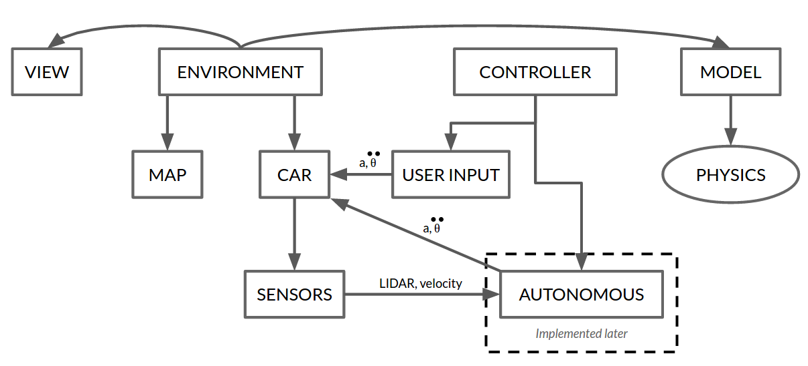
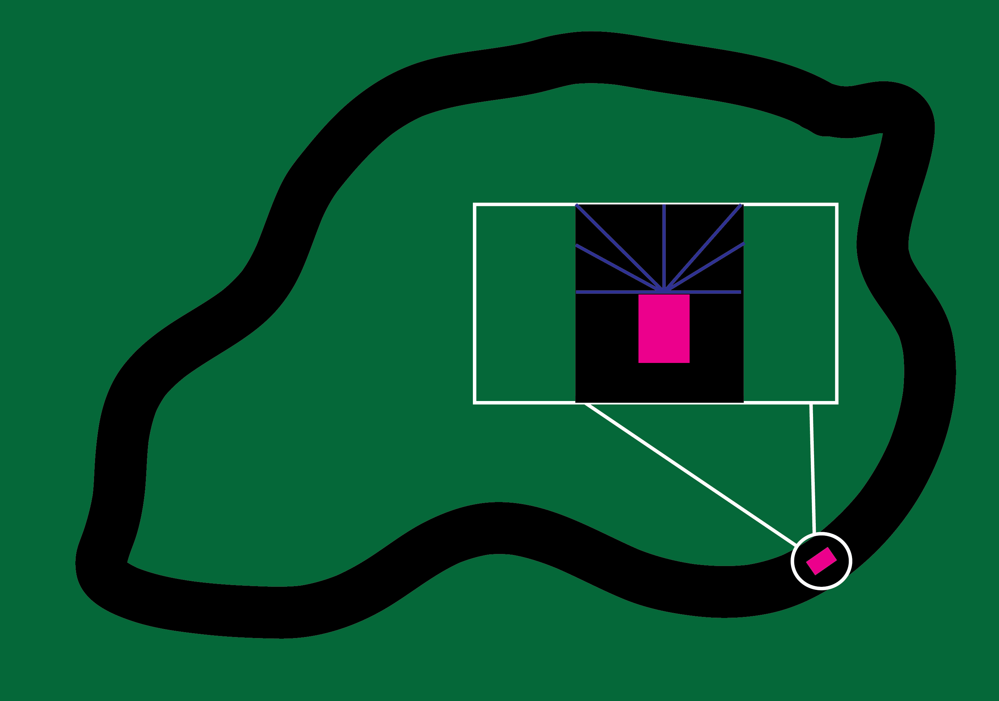

# Architectural Review
###### Adam, Alex, Aurora, Matt, Gretchen

## What We Hope to Get From the Review:
  * Guidance on implementing Machine learning
  * Better understanding of neural networks
  * Input on whether our final goals are feasible or not

## Background and Context:
  This program will allow the user to create a race track. It will then drive a
  car around the track. The car will be driven around the track using machine learning (through a neural network) to learn where the edge of the track is
  so as not to drive off it.

  The MVP will include physics to drive the car realistically (as a hovercraft).
  It will also include code to render the car and track in a pygame window as
  well as code to allow the user to draw a track.

  The machine learning will be able to look at "LIDAR" input and the velocity of
  the car to control it's acceleration to drive it around the track.

  
  Above is a UML diagram of our architectural plan.

  
  Above is an image depicting the LIDAR in the car.

## Key Questions:
  * Neural networking?
  * What python framework should we use for neural networking?
  * What parameters should we control with the neural network?
  * How do we translate LIDAR information and velocity into acceleration?
  * How do we accurately model car physics (i.e. traction, friction, etc)?

## Agenda for Technical Review Session:
  3 minutes: Overview of project  
  10 minutes: In depth explanation of game architecture and technicalities  
  7 minutes: Asking our questions for input

## Strategies to Present
  We will show the picture of the architectural design (shown above). With this
  diagram we will explain the overlaying architectural design as well as the
  technicalities included. After our explanation we will talk with the audience
  about our key questions, explaining what we understand while trying to figure
  out more from what they understand.
